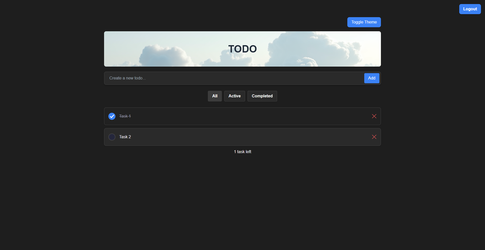
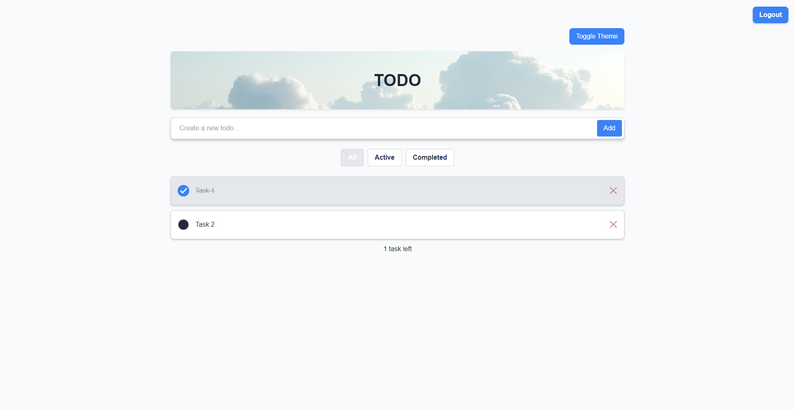
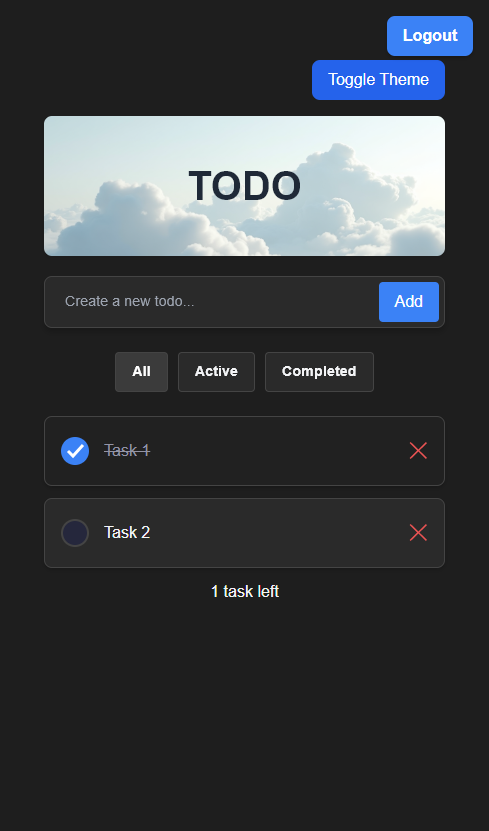
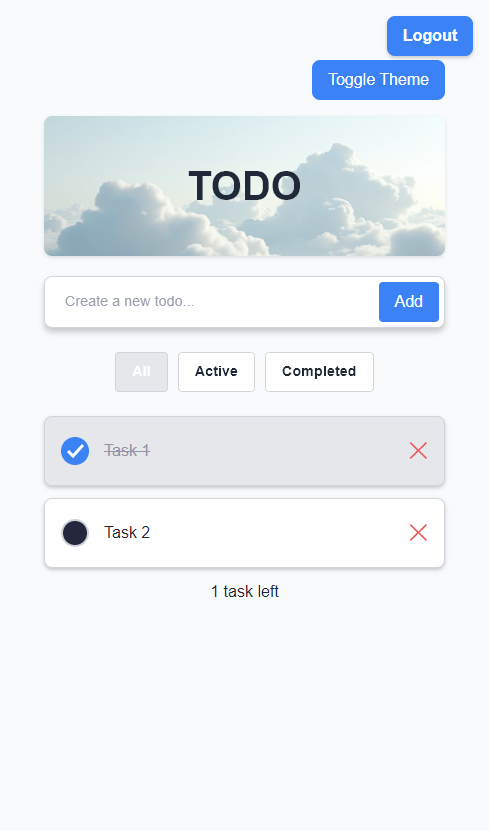

# TODO-APP 📋

**Современное и адаптивное приложение для управления задачами с поддержкой светлой и тёмной темы, построенное с использованием React, Vite, Zustand и Tailwind CSS.**

---

## 🌟 **Функциональность**
- Добавление, удаление и отметка задач как выполненные.
- Сохранение задач для конкретного пользователя.
- Переключение между **светлой** и **тёмной** темой.
- Адаптивный дизайн: приложение корректно отображается как на мобильных устройствах, так и на компьютерах.

---

## 🖥️ **Демонстрация проекта**






---

## 🚀 **Технологии**
- **React**: Библиотека для создания пользовательских интерфейсов.
- **Vite**: Быстрая сборка и оптимизация проекта.
- **Zustand**: Лёгкий и эффективный стейт-менеджмент.
- **Tailwind CSS**: Утилитарный CSS для быстрой стилизации.
- **TypeScript**: Добавляет статическую типизацию к проекту.

---

## 📦 **Запуск проекта**

1. **Клонируйте репозиторий**:
   ```bash
   git clone https://github.com/username/repository-name.git
   cd repository-name

## 👨‍💻 **Автор**
Разработано с 💻 и ☕ [Azim]

## 👀 **Посмотреть на сайт**

Можно посмотреть тут: https://site-todo-pi.vercel.app/
